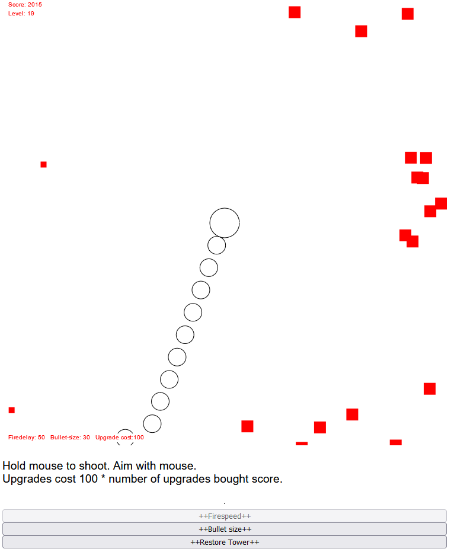

# Pixel-wars

## Squares vs Circles - A Tower shooter
Further readme inside module.

## Installation
- 1 Clone into a local folder using $ git clone
- 2 Run 'npm install'
- 2 Run 'npm run dev'

## Usage
Open the vite emulated webserver in a browser.
Obs. for entertainment and educational purpose only!

## Authors and acknowledgment

- ॐ नमः शिवाय
- Sir Terry Pratchett, becuase Terry should always be acknowledged.
- Douglas Adams, becuase Douglas should always be acknowledged.

## License
CC-BY-NC4.0
https://creativecommons.org/licenses/by-nc/4.0/

## Project status
Project is currently functional.

## Bugs and support
Please contact me throught discord, slack or student email. In that prefered order.